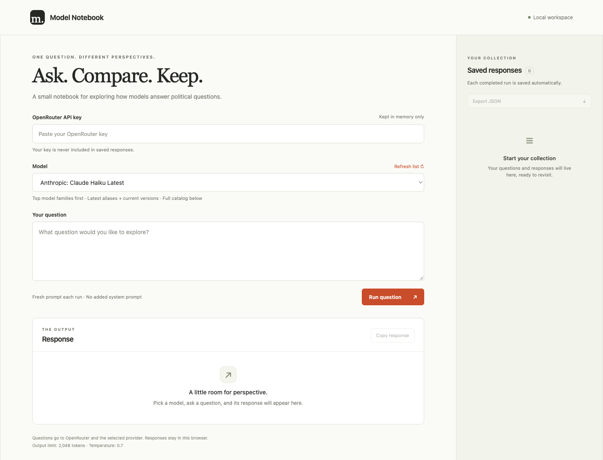

# Model Notebook

A tiny localhost UI for asking political questions across OpenRouter models. Pick a model, ask a question, and keep its answer in a sidebar. Python's standard library + plain HTML, CSS, and JavaScript. No packages, build step, account system, or database.



## New to this? Let an agent help

Copy this into Codex, Claude Code, or another coding agent that can run commands on your computer:

> Set up https://github.com/charliec2004/model-notebook on my computer. Read and follow its AGENTS.md. Check Python, start the local app, open the UI, and walk me through creating an OpenRouter API key. I am non-technical. Keep the key out of chat and files; I will paste it into the app myself. Explain any costs before I run a question.

The agent can handle the local setup. You sign in to OpenRouter, choose your spending limit, and enter your key yourself. See the [beginner setup guide](docs/SETUP.md) for each step, including a manual setup option.

## Run

Requires Python 3.9+ and a modern browser.

```sh
python3 server.py
```

Open **http://127.0.0.1:8000**, paste your [OpenRouter API key](https://openrouter.ai/settings/keys), choose a model, and click **Run question**. On Windows, use `py server.py` if `python3` isn't available. To change the port: `python3 server.py --port 8001`.

You can also provide `OPENROUTER_API_KEY` through your environment or secret manager. A key entered in the UI overrides it for that run. The app does not load `.env` files.

## What it does

- Loads OpenRouter's current text model catalog (cached for five minutes). The selector puts Claude Haiku/Sonnet/Opus/Fable, OpenAI Luna/Terra/Sol/Astra, DeepSeek, Gemini, Grok, and Meta Muse first, with the other text models below. Batch models are excluded because this app makes synchronous requests.
- Shows available latest aliases alongside the newest pinned releases in each family. Muse includes the newest Spark versions (currently 1.3 and 1.3 Contributor). Only models actually present in the live catalog are offered; future releases appear automatically. Latest aliases can change their target over time, so saved records include both the requested ID and the returned model ID.
- Sends one independent user message each run, without a system message or previous conversation.
- Uses temperature `0.7` and a maximum output of `2048` tokens. Some models may interpret these settings differently or reject unsupported parameters.
- Automatically saves completed responses in this browser's local storage. Click a saved question to revisit it; remove a response and undo the last removal.
- Copies the current response or exports all saved responses to JSON, including question, requested/returned model, provider when supplied, timestamp, parameters, finish reason, and usage when supplied. Keys are excluded.

Responses are displayed as plain text. Refusals are preserved when returned as text. Failed requests are shown as errors and are not added to the collection. This is an exploratory notebook, not a statistical benchmark: repeated runs can differ, and model/provider versions can change.

## Privacy and limits

The server binds only to `127.0.0.1`. A temporary session token, strict Host/Origin checks, no cross-origin access, and a content security policy protect the local API. Requests go only to the fixed OpenRouter HTTPS endpoint; redirects are rejected. Keep it local rather than exposing it through a tunnel or deploying it publicly.

UI keys stay in page memory and are cleared on reload; environment keys stay in server memory. Keys, prompts, and responses are not logged or written to server files. Your prompt and key are sent to OpenRouter; prompts are also processed by the selected provider according to their policies. API calls can cost credits. No automatic retries are made, because a timed-out request may still be billed.

Saved questions and responses are unencrypted browser data for this exact origin (host + port). Clearing site data deletes them; using a different port or browser opens a separate collection. If storage is blocked or full, the UI warns you and keeps new responses in memory so you can export them before closing. Exported files may contain sensitive questions or answers.

One run at a time, up to ten runs per minute, with a 120-second upstream timeout. Questions are limited to 20,000 characters. Reload the page after restarting the server to receive its new session token.

## Check

```sh
python3 -m unittest discover -s tests -v
```

Tests use fake OpenRouter responses and do not need an API key or spend credits.

## Contributing

The app intentionally stays small. Follow [AGENTS.md](AGENTS.md) for setup, verification, and privacy rules. `.gitignore` excludes secret files, exports, caches, and browser artifacts. The project uses the MIT license.

API references: [chat completions](https://openrouter.ai/docs/api/api-reference/chat/create-a-chat-completion) and [model catalog](https://openrouter.ai/docs/api/api-reference/models/list-all-models-and-their-properties).
